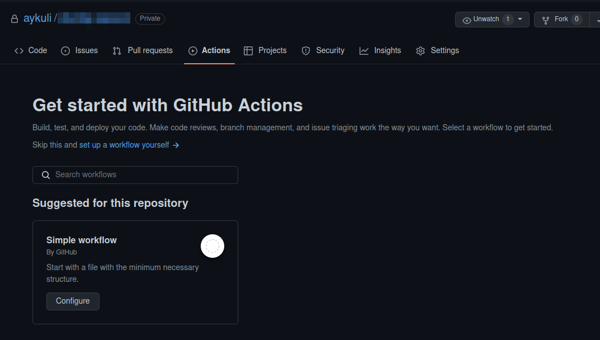
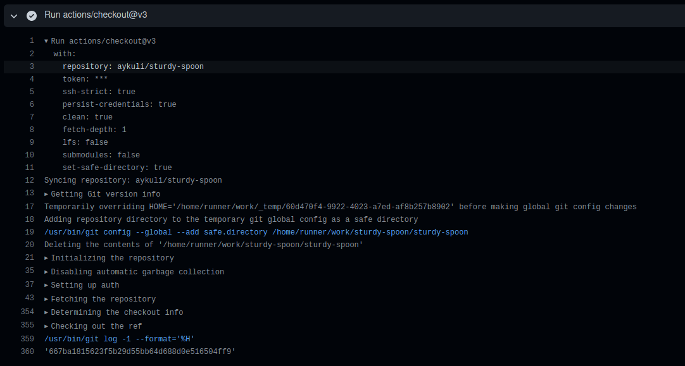
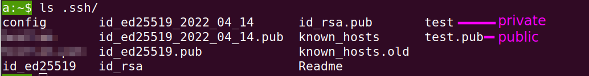
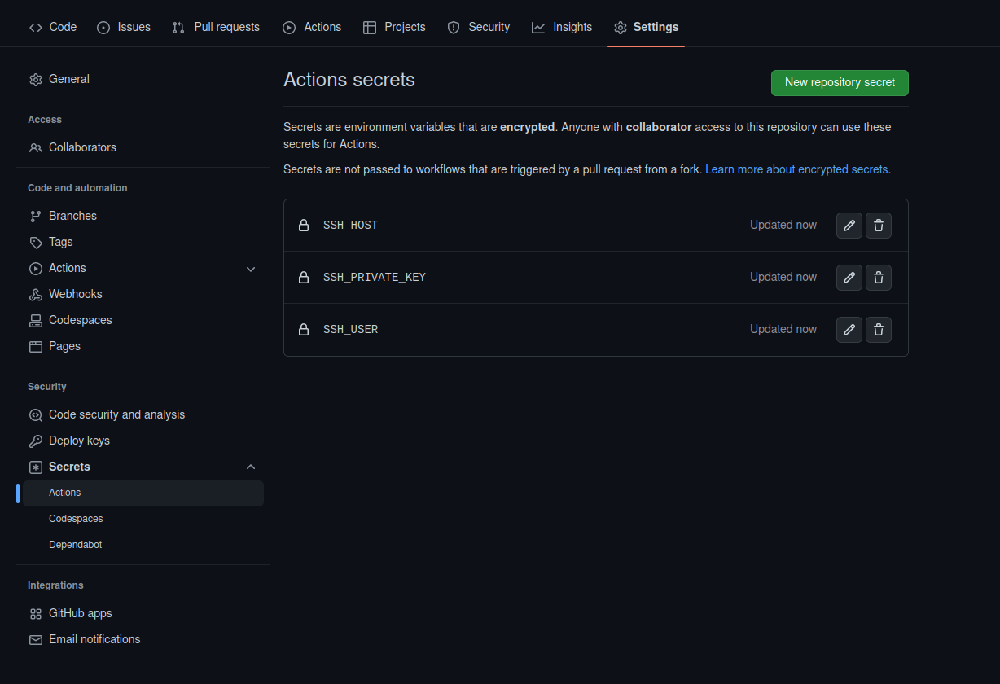

# Github Actions новичкам от новичка

## Содержание

[Введение](#entry)
[1. Цель](#goal)
[2. Workflow файлы](#workflow-files)
[3. Actions](#actions)
[4. Мой пример](#example)
[5. Secrets](#secrets)
[Заключение](#conclusion)

## <span id='entry'>Введение</span>

Относительно недавно, как сказал мой тимлид, я "перешла на темную сторону" - делала клиентские приложения, сейчас делаю серверное. Соответственно, мне надо соотвествовать - читать, учиться, практиковать и развиваться в этом направлении, делать какие-то проекты помимо работы. Еще не придумала какой, но пусть, скажем, это будет блог. Для этого я арендовала сервер VDS. Решила начать с автомитизирации процесса деплоя при появлении новых изменений. На github для этого есть [GitHub Actions](https://docs.github.com/ru/actions), так как репозиторий с проектом я буду хранить там.
Итак, здесь я буду расссказывать о моем опыте настройки [CD(continuous deployment)](https://ru.wikipedia.org/wiki/CI/CD) c помощью [GitHub Actions](https://docs.github.com/ru/actions).

## <span id='goal'>1. Цель</span>

Цель суеты - автоматический деплой при определенном событий в проекте.
В этой статье мой проект создан генератором Ruby on Rails. Не важно с коким стеком у вас репозиторий на гитхабе, главное - понять, как работают Github Actions и уметь применить его для любого проекта, найдя нужные `actions` из [Github Marketplace](https://github.com/marketplace/) (про написать свой на хабре есть статья).
Деплой происходит при определенном действий, например, при мерже рабочей ветки в ветку main. Это должно запускать процессы:

- проверкаь кода линтером
- запуск тестов
- получение изменений в файлах в папке проекта на удаленном сервере.
- перезапуск контейнером с проектом на удаленном сервере, чтоб изменения вступили в силу.

## <span id='workflow-files'>2. Workflow файлы</span>

Workflow файлами Github запускает Actions, выполняющие интересующие нас действия.

Для этого я перешла на вкладку `Actions` на странице репозитория. На базе вашего кода там предлагаются разные варианты, но можно начать с `Simple workflow`.



Я начала с предложенного wokflow файла "Ruby on Rails CI".
Есть [краткое руководство](https://docs.github.com/ru/actions/quickstart#creating-your-first-workflow) по написанию и чтению файла workflow. Воспользуйтесь.

После создания name-of-your-wokflow-file.yml файла, в репозиторий у вас появится папка c файлом `.github/workflows/name-of-your-wokflow-file.yml`. Workflow файлов можно создавать несколько.

<details>
   <summary>Пример базового workflow файла simple.yml</summary>
   
   ```shell
name: CI
on:
   # События, которые запускают jobs
   push:
      branches: [ "main" ]
   pull_request:
      branches: [ "main" ]

# jobs запускаются параллельно, если не указана последовательность
jobs:
   # Название job вы можете назвать как угодно
   build:

   # Операционная система, в которой запускаются процессы
   runs-on: ubuntu-latest
      # Шаги
      steps:
         # Actions от github: проверяет репозиторий, гит и т.д.
         - uses: actions/checkout@v3

         # Пример однолинейного простого скрипта shell
         - name: Run a one-line script
            run: echo Hello, world!

         # Пример многолинейного скрипта shell
         - name: Run a multi-line script
            run: |
               echo Add other actions to build,
               echo test, and deploy your project.

```
</details>

## <span id='actions'>3. Actions</span>

Самое интересное тут `actions` в строке `uses`. В простейшем примере выше это - [actions/checkout@v3](https://github.com/actions/checkout). Можно посмотреть в исходниках, что делает экшн. Но проще посмотреть на странице выполнения `job`, после того, как вы его запустите:
   * копирует переменные внутрь контейнера
   * проверяет версию git, пишет файл настройки
   * проверяет репозиторий
   * авторизируется
   * копирует репозиторий внутрь контейнера
   * переходит на ветку main
 


Существует множество `actions`, созданные разработчиками, которые можно использовать, выбрав на [Github Marketplace](https://github.com/marketplace/).
Например, в своих нуждах я использовала [D3rHase/ssh-command-action@v0.2.2](https://github.com/marketplace/actions/ssh-command), который запускает мою консольную команду через [ssh](https://en.wikipedia.org/wiki/OpenSSH) на удаленном сервере.

## <span id='example'>4. Мой пример</span>
Вернемся к моему списку требуемых действии для деплоя. В файле rubyonrails.yml последовательность процессов такая:

1. Проверила линтером код
2. Запустила тесты
3. Действия на удаленном сервере:
   1. Переход в папку с проектом
   2. Получение изменений из репозитория
   3. Копирование .env файла из папки выше в папку с проектом
   4. Пересоздание контейнеров с проектом

Это мой пример. У вас действия могут быть другие, например, если проект - браузерное клиентское приложение - сгенерировать конечные файлы с командой `npm run build` и скопировать файлы после в определенную папку на удаленном серере, из которой уже кушает уже настроенный nginx.

<details>
<summary>Мой пример .github/workflows/rubyonrails.yml</summary>

```shell

# This workflow will install a prebuilt Ruby version, install dependencies, and
# run tests and linters. Then it pulls new features from my repo and
# rebuild containers on remote server through ssh.

name: "Ruby on Rails CI"
on:


```
</details>

Визуально раннеры выглядят симпатично и интуитивно понятно.


Процессы выполняются последовательно, для этого используется ключевое слово `needs` в теле `job`.

Можно зайти в кажый прямоугольник и посмотреть детальнее, что там происходит. Если что-то идет не так, там внутри можно почитать, что не получилось, также можно в скриптах написать для себя визуальные делители или вывод каких-то данных, типа списка файлов.

<details>
<summary>
Пример промежуточного файла на этапе настройки процесса.
</summary>

```shell
- name: Run command on remote server
   uses: D3rHase/ssh-command-action@v0.2.2
   with:
      host: ${{secrets.SSH_HOST}}
      user: ${{secrets.SSH_USER}}
      private_key: ${{secrets.SSH_PRIVATE_KEY}}
      command: |
      echo '--- START WORK ON REMOTE SERVER ---';
      cd /home/projects/aykuli.su/;
      echo '--- LIST OF FILES ---';
      ls -al;
      acho '--- GIT INFORMATION ---'
      git co dev;
      git pull;
      echo '--- DOCKER OPERATIONS ---';
      docker-compose down;
      docker ps;
      docker-compose --file docker-compose.prod.yml up -d;
      docker system prune --all --force;
      echo '--- LIST OF DOCKER CONTAINERS ON REMOTE SERVER ---';
      docker ps;

```
</details>

## <span id='secrets'>5. Secrets</span>
В rubyinrails.yml файле есть переменные, которые вызываются из объекта `secrets`. Эти переменные нужны для того, чтобы подружить ваш удаленный сервер с создающимися контейнерами на github на время выполнения действии. Для этого я сделала шаги:

1. Сгенерировала SSH ключ на удаленном сервере:

```

cd ~/.ssh; ssh-keygen -t ed25519 -C "your_email@example.com"

```

Я назвала ключ test и получила 2 файла - приватный и публичные ключи.


2. Содержимое приватного ключа я скопировала в переменную в `SSH_PRIVATE_KEY` во вкладке `Settings ->Secrets -> Actions`
3. Создала еще перменные `SSH_HOST` и `SSH_USER` с соответствующим содержимым.
   



## <span id='conclusion'>Заключение</span> 
Стоит сказать, что тут предполагается, что ваш репозиторий склонирован в ваш удаленный сервер, и он подружен с Github через `ssh`. На вашем удаленном сервере установлен git и другие нужные вам инстурменты, например, docker, docker-compose, как в моем примере rubyonrails.yml.

Вот теперь пазл собрался:
- Вы знаете, как создавать workflow.yml файлы, что будет запускать нужные вам действия.
- Вы знаете, где и как искать нужные вам экшны или самому написать скрипт, если задача простая.
- Вы знаете, где хранить секреные переменные, котрые вы можете использовать в вашем workflow файле.
- Вы знаете, как дебажить в случае ошибок.

Удовольствия вам от программирования!