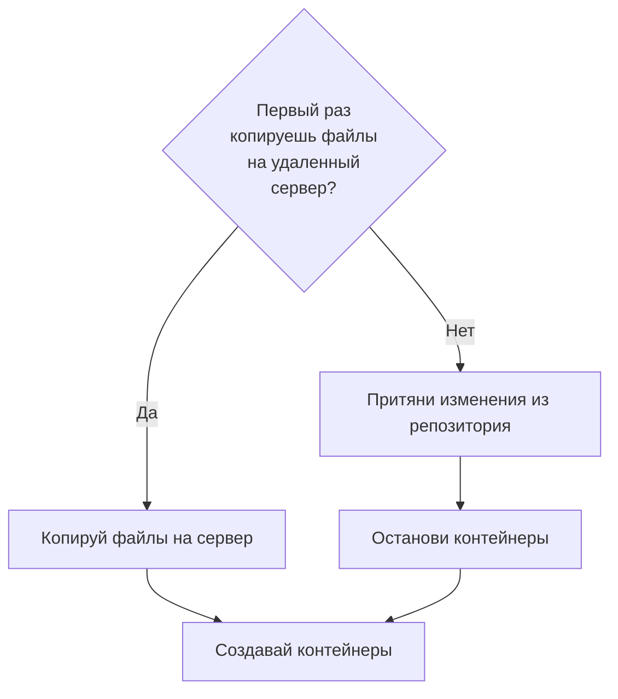

Если жоба запускается в первый раз, если сервер пустой, то копируем файлы, если нет, то используем гит пулл.

```mermaid
flowchart TD
  id1{"Первый раз
  копируешь файлы
  на удаленный
  сервер?"}
  id2[Копируй файлы на сервер]
  id3[Притяни изменения из репозитория]
  id4[Создавай контейнеры]
  id5[Останови контейнеры]

  id1-- Да -->id2
  id1-- Нет -->id3

  id2 --> id4

  id5 --> id4
  id3 --> id5
```
